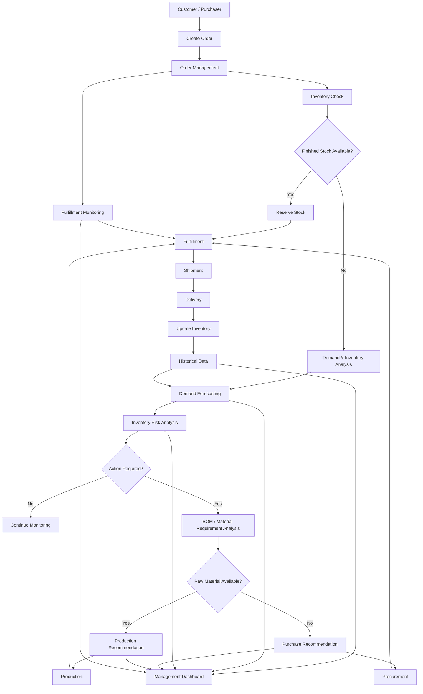
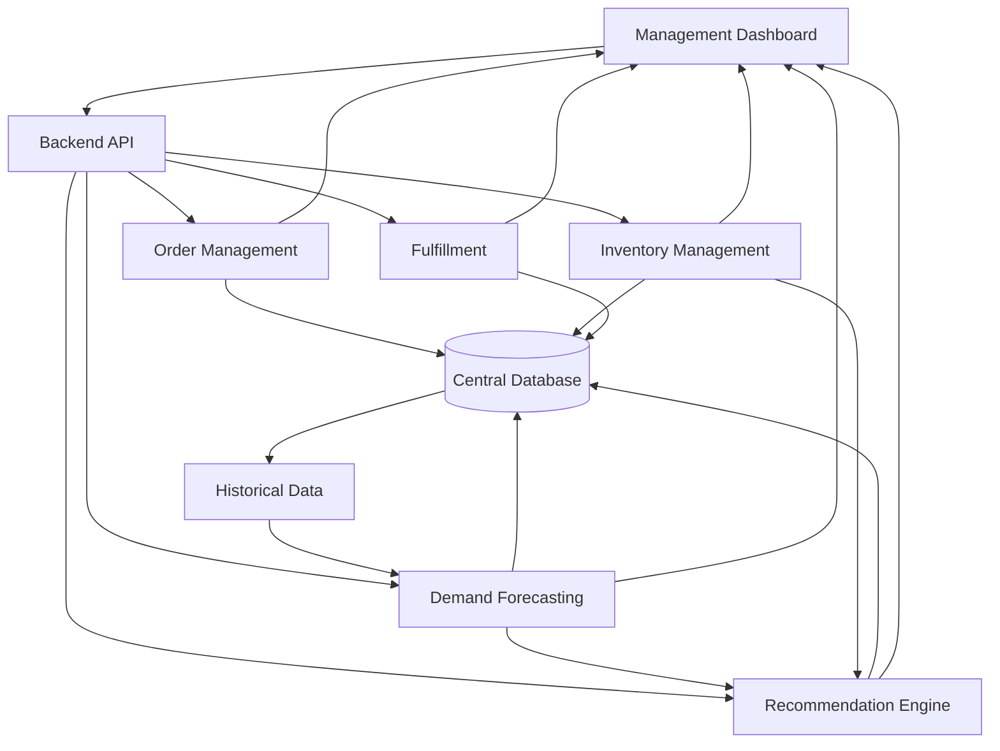

# ZENESYS

### Intelligent Manufacturing Operations, Inventory & Demand Forecasting Platform

> **ZENESYS** is a data-driven platform designed for mechanical-parts manufacturing companies to connect **order management, inventory, production, demand forecasting, and fulfillment** in one system.

The goal is simple:

**Turn manufacturing data into better operational decisions.**

---

## 🚀 What is ZENESYS?

Mechanical manufacturing companies deal with constantly changing customer orders, raw-material availability, production requirements, inventory levels, supplier lead times, and delivery commitments.

When these processes are handled separately, companies can face:

* Stock shortages
* Excess inventory
* Production delays
* Unnecessary purchasing
* Delayed customer orders
* Poor visibility into operations
* Difficulty predicting future demand

**ZENESYS connects these processes into a single intelligent workflow.**

```text
Customer Order
      ↓
Order Tracking
      ↓
Inventory Check
      ↓
Production / Procurement
      ↓
Fulfillment
      ↓
Shipment
      ↓
Delivery
      ↓
Historical Data
      ↓
Demand Forecasting
      ↓
Inventory Analysis
      ↓
Purchase / Production Recommendation
```

---

# 🎯 Problem We Are Solving

Manufacturing companies need to answer critical questions every day:

* Do we have enough stock?
* Which products are approaching a shortage?
* Which raw materials are required for upcoming production?
* What will demand look like in the coming weeks?
* What should we produce?
* What should we purchase?
* How much should we produce or purchase?
* When should we take action?
* Which orders are delayed?
* Why are orders getting delayed?

ZENESYS aims to answer these questions using a combination of **operational data, inventory analytics, demand forecasting, and decision-support logic**.

---

# 💡 Our Solution

ZENESYS combines five major capabilities:

### 1. Order Management

Track customer orders from creation to delivery.

### 2. Inventory Management

Monitor raw materials, work-in-progress, finished goods, reservations, and inventory movements.

### 3. Demand Forecasting

Analyze historical demand and predict future requirements.

### 4. Fulfillment & Issue Detection

Track order fulfillment and identify stock shortages, production problems, and delivery delays.

### 5. Decision Dashboard

Give management a clear view of inventory health, forecasts, alerts, and recommended actions.

---

# 🔄 Complete System Flow



---

# 📦 Inventory Management

Inventory is divided into three major categories:

```text
Raw Materials
      ↓
Work In Progress
      ↓
Finished Goods
```

ZENESYS tracks inventory movements such as:

* Purchases
* Production output
* Sales
* Material consumption
* Returns
* Adjustments
* Reservations
* Stock transfers

The system maintains historical inventory transactions instead of simply overwriting stock quantities.

---

# 🏭 Manufacturing Intelligence

Because ZENESYS is designed for manufacturing, the system considers the relationship between **finished products and their required materials**.

This is handled using a **Bill of Materials (BOM)**.

Example:

```text
PART-001
│
├── Steel Shaft × 1
├── Gear × 2
├── Bearing × 2
└── Bolt × 6
```

If 100 units of `PART-001` are required:

```text
Steel Shaft → 100
Gear        → 200
Bearing     → 200
Bolt        → 600
```

The system can then compare these requirements with available raw-material inventory.

This allows ZENESYS to distinguish between:

**Produce → Purchase → Monitor**

instead of treating every inventory shortage as the same problem.

---

# 🔮 Demand Forecasting

ZENESYS uses historical operational data to estimate future demand.

Potential forecasting inputs include:

* Historical orders
* Sales history
* Product demand
* Inventory history
* Production history
* Stockout events
* Demand trends
* Seasonal patterns

Initial forecasting horizons:

```text
7 Days
30 Days
90 Days
```

Forecasting models will be evaluated against historical data using appropriate statistical error metrics rather than assuming that a prediction is automatically accurate.

---

# 🧠 Recommendation Engine

The forecasting system is not the final goal.

The final goal is **actionable decision support**.

ZENESYS aims to answer:

```text
What?
How Much?
When?
Why?
```

Possible recommendations include:

```text
PRODUCE
PURCHASE
WAIT
MONITOR
EXPEDITE
```

Example:

```text
Forecast Demand       = 500
Safety Stock          = 50
Available + Incoming  = 420

Required Inventory    = 550

Potential Shortage    = 130

Recommendation:
Produce / Purchase 130 units
```

The final recommendation can also consider:

* Current stock
* Reserved stock
* Incoming stock
* Demand forecast
* Safety stock
* Reorder point
* Supplier lead time
* BOM requirements
* Production capacity
* Customer priority
* Required delivery date

---

# 📊 Management Dashboard

The dashboard provides management with a centralized operational view.

### Key information

* Active orders
* Delayed orders
* Current inventory
* Low-stock products
* Stockout risks
* Overstock risks
* Demand forecasts
* Production requirements
* Purchase recommendations
* Fulfillment issues
* Critical alerts

Example:

```text
┌────────────────────────────────────────┐
│           ZENESYS DASHBOARD            │
├───────────┬───────────┬────────────────┤
│ ORDERS    │ INVENTORY │ DELAYED ORDERS │
├───────────┴───────────┴────────────────┤
│                                        │
│        INVENTORY HEALTH                 │
│                                        │
├────────────────────────────────────────┤
│                                        │
│        DEMAND FORECAST                  │
│                                        │
├────────────────────────────────────────┤
│                                        │
│        STOCK RISK / ALERTS              │
│                                        │
├────────────────────────────────────────┤
│                                        │
│        PURCHASE RECOMMENDATIONS         │
│                                        │
└────────────────────────────────────────┘
```

---

# 🏗️ System Architecture



---

# 👥 Team Responsibilities

| Member    | Responsibility                            |
| --------- | ----------------------------------------- |
| **Kunal** | Order Management & Order Database         |
| **Aryan** | Inventory Management & Demand Forecasting |
| **Om**    | Fulfillment & Issue Detection             |
| **Pawan** | Dashboard & System Integration            |

### Kunal

Responsible for:

* Customer orders
* Order database
* Order status
* Order history
* Order updates
* Inventory reservation

### Aryan

Responsible for:

* Inventory management
* Inventory calculations
* Inventory risk
* Safety stock
* Reorder point
* Demand analysis
* Demand forecasting
* Forecast evaluation
* Inventory recommendations

### Om

Responsible for:

* Fulfillment workflow
* Picking
* Packing
* Shipment tracking
* Delivery tracking
* Delay detection
* Fulfillment issues

### Pawan

Responsible for:

* Management dashboard
* Data visualization
* Frontend integration
* API integration
* Connecting system modules

---

# 🛠️ Technology Stack

The implementation is planned around:

| Layer            | Technology                             |
| ---------------- | -------------------------------------- |
| Frontend         | React / Next.js                        |
| Backend          | Python / FastAPI                       |
| Database         | PostgreSQL / Supabase                  |
| Data Processing  | Python, Pandas, NumPy                  |
| Machine Learning | Scikit-learn and forecasting libraries |
| Visualization    | Web-based dashboard                    |
| Version Control  | Git & GitHub                           |

The final technology choices may evolve during development.

---

# 📁 Repository Structure

```text
Team-Spock-ZENESYS/
│
├── README.md
│
├── docs/
│   ├── product-flow.md
│   ├── system-architecture.md
│   ├── modules.md
│   └── database.md
│
├── order-management/
│
├── inventory-management/
│
├── forecasting/
│
├── fulfillment/
│
└── dashboard/
```

---

# 🗺️ Development Roadmap

### Phase 1 — Architecture

* [x] Define project objective
* [x] Define product flow
* [x] Define major modules
* [x] Define team responsibilities
* [ ] Finalize technical architecture

### Phase 2 — Database

* [ ] Design database schema
* [ ] Implement order tables
* [ ] Implement inventory tables
* [ ] Implement product and BOM tables
* [ ] Implement supplier tables
* [ ] Implement production tables
* [ ] Implement shipment tables
* [ ] Implement forecasting tables

### Phase 3 — Core Operations

* [ ] Order creation
* [ ] Order tracking
* [ ] Inventory tracking
* [ ] Stock reservation
* [ ] Inventory transactions
* [ ] Fulfillment workflow

### Phase 4 — Intelligence

* [ ] Historical data processing
* [ ] Demand analysis
* [ ] Forecasting
* [ ] Inventory risk analysis
* [ ] Safety stock calculation
* [ ] Reorder point calculation
* [ ] Recommendation engine

### Phase 5 — Dashboard

* [ ] Order dashboard
* [ ] Inventory dashboard
* [ ] Forecast dashboard
* [ ] Fulfillment dashboard
* [ ] Alerts
* [ ] Purchase recommendations
* [ ] Production recommendations

### Phase 6 — Testing & Integration

* [ ] Backend integration
* [ ] Frontend integration
* [ ] Forecast validation
* [ ] Inventory calculation testing
* [ ] End-to-end testing
* [ ] Edge-case testing

---

# 📚 Documentation

Detailed technical documentation will be maintained separately.

| Document                                                | Purpose                    |
| ------------------------------------------------------- | -------------------------- |
| [`product-flow.md`](docs/product-flow.md)               | Complete business workflow |
| [`system-architecture.md`](docs/system-architecture.md) | Technical architecture     |
| [`modules.md`](docs/modules.md)                         | Module responsibilities    |
| [`database.md`](docs/database.md)                       | Database design            |

---

# 🎯 Project Objective

ZENESYS aims to transform manufacturing operations from:

```text
Raw Data
   ↓
Manual Analysis
   ↓
Reactive Decisions
```

into:

```text
Operational Data
      ↓
Analytics
      ↓
Demand Forecast
      ↓
Inventory Intelligence
      ↓
Actionable Recommendation
      ↓
Better Decision
```

The long-term objective is to create a system that helps mechanical-parts manufacturers **anticipate inventory requirements instead of reacting to shortages after they happen.**

---

# 📌 Project Status

**Current Stage:** Architecture & Development Planning

The project is currently establishing its database architecture, system modules, inventory workflow, forecasting pipeline, and dashboard requirements.

---

## 📄 License

This project is currently developed as a team project for educational, research, and demonstration purposes.

